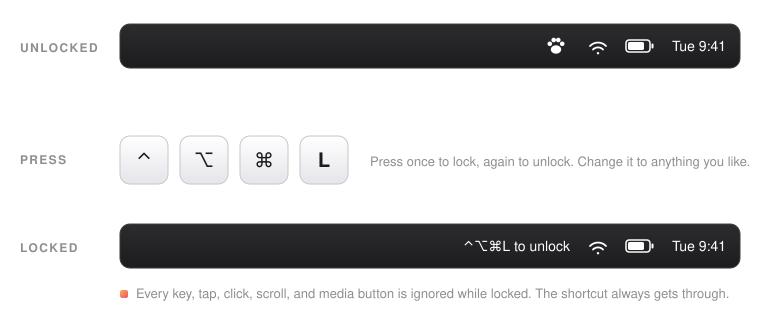

<p align="center">
  
</p>

<h1 align="center">Cat Protector</h1>

<p align="center">
  <strong>One shortcut locks your Mac's keyboard and trackpad. Your cat naps on them. Nothing happens.</strong>
</p>

<p align="center">
  <a href="https://github.com/brandonmontez/cat-protector/actions/workflows/ci.yml"></a>
  
  
  
  <a href="LICENSE"></a>
</p>

<p align="center">
  
</p>

Cats love laptops. Warm, quiet, right where you are looking. The trouble is that a cat on a keyboard is also a cat pausing your show, muting the volume, opening windows, and typing into whatever had focus.

Cat Protector is a tiny menu bar app that fixes exactly that. Press **⌃⌥⌘L** and every key, tap, click, scroll, gesture, and media button is ignored. The cat settles in, the show keeps playing, your terminal stays clean. Press **⌃⌥⌘L** again and everything is back.

- **Blocks everything.** Keyboard, trackpad, mouse, scroll, gestures, and the media and volume keys.
- **One shortcut in, one shortcut out.** Change it to anything you like from the menu.
- **Impossible to forget.** While locked, the menu bar item itself reads "⌃⌥⌘L to unlock".
- **Instant.** Input is blocked before the next event arrives, and the feedback is measured in single-digit milliseconds.
- **Quiet.** A brief banner and a purr when you lock, both optional. No Dock icon.
- **Trustworthy by construction.** No network code, no files, no dependencies. A test fails the build if any are ever added.

## Install

### Download

1. Grab `Cat-Protector.zip` from the [latest release](../../releases/latest), unzip it, and drag **Cat Protector** into your Applications folder.
2. Open it. macOS will refuse the first time, because this free app is not notarized with Apple. Click **Done**, then open **System Settings → Privacy & Security**, scroll down to the message about Cat Protector, and click **Open Anyway**. You only do this once.
3. Grant Accessibility access when asked (see below).

If you prefer the terminal, this removes the quarantine flag instead of step 2:

```bash
xattr -dr com.apple.quarantine "/Applications/Cat Protector.app"
```

### Build from source

Requires Xcode or the Command Line Tools on macOS 13 or later. No other dependencies.

```bash
git clone https://github.com/brandonmontez/cat-protector.git
cd cat-protector
make install
```

That compiles the app and copies it into `/Applications`.

### Accessibility access

Cat Protector needs the macOS **Accessibility** permission. It is the permission that lets an app see and filter input for the whole system, and there is no way to block keys before other apps receive them without it.

On first launch macOS shows a dialog saying the app "would like to control this computer using accessibility features". Click **Open System Settings**, turn on **Cat Protector**, and the paw print in your menu bar is live. If you dismissed the dialog, the menu bar icon has a **Grant Accessibility Access…** item that opens the same pane.

## Use

| Action | How |
| --- | --- |
| Lock or unlock | Press **⌃⌥⌘L** (Control + Option + Command + L) |
| Lock or unlock with the mouse | Click the paw print in the menu bar, then the first item |
| Change the shortcut | Menu bar → **Shortcut: ⌃⌥⌘L…**, then press the new combination |
| Turn the banner or sound off | Menu bar → uncheck **Show On-Screen Banner** or **Play Sound** |
| Run it automatically | Menu bar → **Start at Login** |

While locked, the shortcut is the **only** input the Mac responds to. A new shortcut must include at least one of ⌃, ⌥, or ⌘, so a stray paw cannot trigger it.

## Privacy

An app that can see every keystroke deserves scrutiny. Cat Protector is built so that the scrutiny is easy:

- **No networking.** There is no network code of any kind, and [a test](Tests/CatProtectorTests/TrustTests.swift) fails the build if networking, process spawning, or file writing is ever added to the app's sources.
- **Nothing is recorded.** Each event is compared against the shortcut and then either dropped or passed through. Key codes are never stored.
- **Only preferences are saved.** The shortcut and two on/off settings, in the app's own preferences.
- **It is small.** About 1,300 lines of Swift with no dependencies. Reading all of it takes fifteen minutes.

See [SECURITY.md](SECURITY.md) for how to report a problem.

## How it works

Cat Protector installs a Core Graphics [event tap](https://developer.apple.com/documentation/coregraphics/cgevent/1454426-tapcreate) at the HID level, the earliest point at which an app can see input. Every event passes through a small pure-Swift state machine, [`LockEngine`](Sources/CatProtector/LockEngine.swift):

- **Unlocked:** everything passes through untouched.
- **Locked:** everything is dropped, except the toggle shortcut, which flips the state and is itself dropped so no app ever sees it.

The tap runs on its own thread, so a busy UI can never delay input handling, and it re-enables itself if macOS ever disables it. Feedback is deliberately boring: the banner is pre-rendered, the sounds are warmed up at launch, and nothing on the toggle path allocates, loads from disk, or talks to another process.

```
Sources/CatProtector/
├── main.swift                    App entry point
├── AppDelegate.swift             Menu bar item, menu, permission flow, feedback
├── InputLock.swift               CGEventTap wiring on a dedicated thread
├── LockEngine.swift              Pure state machine (unit tested)
├── Hotkey.swift                  Shortcut model, key code → readable name
├── ShortcutRecorderWindow.swift  "Press your new shortcut" window
├── OverlayWindow.swift           The lock/unlock banner
├── ReminderPill.swift            Full-screen fallback reminder
├── Throttle.swift                Rate limiter for blocked-input notifications
├── Settings.swift                UserDefaults wrapper
├── Permissions.swift             Accessibility permission helpers
└── Diagnostics.swift             Debug timing logs
```

## FAQ

**What if I forget the shortcut?**
While locked, the menu bar item reads "⌃⌥⌘L to unlock". If a full-screen app is hiding the menu bar, a small reminder appears in the top-right corner of every screen for a few seconds whenever a blocked key press or click happens, so the moment you try to type, the answer is right there. As a last resort, the power button is never blocked: hold it for about ten seconds to force a restart, which clears the lock.

**Is it safe? What if the app crashes?**
The shortcut is handled by the same code that blocks everything else, so it always works while the app is running. If Cat Protector crashes or is quit, macOS removes the block automatically. Closing the lid, sleeping, and rebooting all behave normally.

**Does it block the Touch ID or power button?**
No. Those are handled by hardware and the app never sees them, so you can always lock or sleep the Mac. The password field on the wake screen uses macOS secure input, which bypasses event taps, so you can always log back in.

**Does it work with external keyboards and mice?**
Yes. The lock applies to every input device connected to the Mac.

**Why does it stop working after I rebuild it from source?**
The app is signed ad hoc, so every build is a "new" app to macOS. Toggle it off and on in System Settings → Privacy & Security → Accessibility.

**It feels slow.**
The block itself takes effect before the next input event. If the banner or sound seem late, run this in Terminal, press the shortcut a few times, and open an issue with the output:

```bash
log stream --predicate 'subsystem == "com.catprotector.CatProtector"' --level debug --style compact
```

**Does it stop my cat from closing the lid?**
No, but to be fair, that is a very determined cat.

## Contributing

Bug reports, ideas, and pull requests are welcome. Please read [CONTRIBUTING.md](CONTRIBUTING.md) first; it is short. The project aims to stay tiny, so features that make it simpler, safer, or more useful for someone with a cat on the keyboard are an easy yes, and new settings are a harder sell than better defaults.

```bash
make test       # run the unit tests
make app        # release .app bundle in ./build
make universal  # Apple silicon + Intel bundle
make dist       # zip it for distribution
make icon       # regenerate Resources/AppIcon.icns
```

## Acknowledgements

The lock and unlock sounds are macOS's own *Purr* and *Pop* system sounds, played from the system at runtime and not distributed with the app. If you only need to wipe a keyboard rather than protect it from a cat, [KeyboardCleanTool](https://folivora.ai/keyboardcleantool) is a fine alternative for the keyboard alone.

## License

[MIT](LICENSE). Free for everyone, cats included.
